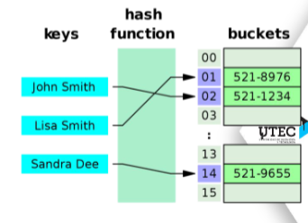
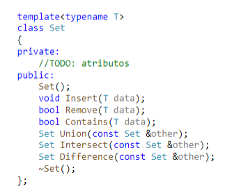

# Hashtable-and-Set-implementation
## Collaborators
- Fabryzzio Jossue Meza Torres
- Fernando Alonso Usurin Arias
- Yoselyn Victoria Miranda Chirinos
## Hash Table

## Set (using Hashing)

## Referencias APA
- Massachusetts Institute of Technology. (2020). Recitation 2. Demaine,E.,Ku,J., & Solomon, J., *Introduction to Algorithms: 6.006* (pp. 6-7 ).MIT
- Tablas Hash.(2024). Ojeda,B.,*Algoritmo y estructura de datos: CS2023* (pp. 1-33).UTEC
